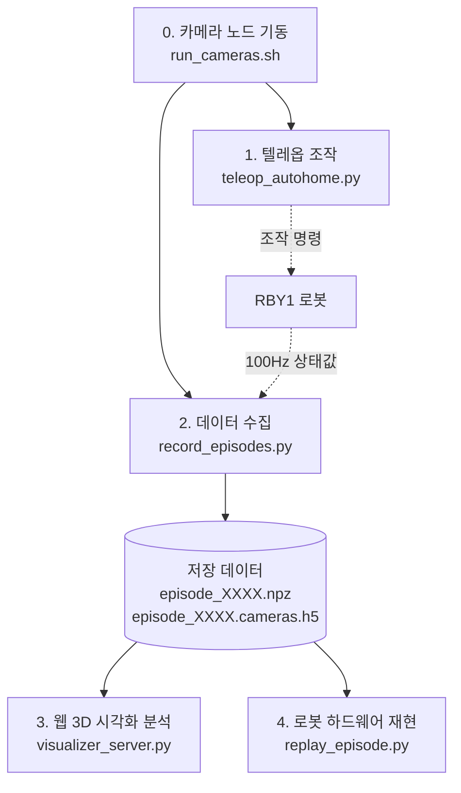

# RBY1 텔레옵, 데이터 수집, 시각화, 리플레이 통합 사용자 가이드

이 문서는 RBY1 로봇의 **임의 자세 기반 텔레오퍼레이션**, **3개 카메라 동기화 멀티 에피소드 데이터 수집**, **웹 기반 3D URDF 데이터 분석기**, **하드웨어 궤적 재생(Replay)** 파이프라인의 전체 실행 가이드입니다.

---

## 📋 전체 파이프라인 요약



---

## 🚀 빠른 시작: 3단계 워크플로우

### 0단계: 3개 카메라 노드 실행 (터미널 0)
Head ZED 카메라 및 양손 RealSense 카메라의 공유 메모리(`/dev/shm`) 스트리밍 노드를 실행합니다.

```bash
# 터미널 0 (백그라운드 유지)
cd /home/nvidia/openpi_rby1
./camera_stack/run_cameras.sh
```

---

### 1단계: 임의 자세 기반 텔레오퍼레이션 (터미널 1)
로봇의 현재 자세를 자동 감지하여 리더암을 안전하게 5초 동안 Auto-Homing 한 뒤, 양팔 텔레옵 및 모바일 베이스 주행(WASDQE)을 제어합니다.

```bash
# 터미널 1 (텔레옵 전용)
/mnt/ssd/rby1-sdk/.venv/bin/python /mnt/ssd/rby1-sdk/examples/python/leader_arm_mobile_record_replay/teleop_autohome.py \
    --address 192.168.30.1:50051 \
    --model a
```

---

### 2단계: 대화형 멀티 에피소드 데이터 수집 (터미널 2)
로봇의 100 Hz 상태값과 3개 카메라(30 Hz) 영상을 `episode_0000`, `episode_0001` 순으로 인터랙티브하게 수집/저장/폐기합니다.

```bash
# 터미널 2 (데이터 수집 전용)
/mnt/ssd/rby1-sdk/.venv/bin/python /mnt/ssd/rby1-sdk/examples/python/leader_arm_mobile_record_replay/record_episodes.py \
    --address 192.168.30.1:50051 \
    --model a
```

#### 🎮 데이터 수집 단축키
| 단축키 | 동작 설명 |
| :---: | :--- |
| `s` | **새 에피소드 녹화 시작** (로봇 100Hz + 카메라 30Hz HDF5) |
| `e` | **현재 에피소드 저장 및 다음 준비** (`episode_XXXX.npz` & `.cameras.h5`) |
| `x` | **실수한 에피소드 즉시 폐기** (동일 번호로 재준비) |
| `q` | 녹화 프로그램 종료 |

### 1단계: 텔레오퍼레이션 (Teleoperation with Auto-Homing)
로봇이 현재 어떤 임의의 작업 자세에 있더라도, **리더암이 로봇의 현재 자세를 자동으로 추종(Auto-Homing)**하여 안전하게 텔레옵을 시작합니다.

- **스크립트**: `teleop_autohome.py`
- **파이썬 환경**: `/mnt/ssd/rby1-sdk/.venv/bin/python`

```bash
# 터미널 1
/mnt/ssd/rby1-sdk/.venv/bin/python /mnt/ssd/rby1-sdk/examples/python/leader_arm_mobile_record_replay/teleop_autohome.py \
    --address 192.168.30.1:50051 \
    --model a \
    --mode position
```

#### 🎮 조작법
- **양팔 리더암**: 사용자가 손으로 움직이는 각도대로 로봇 팔이 1:1 실시간 추종
- **그리퍼 조작**: 리더암 손잡이의 트리거 스위치로 그리퍼 열림/닫힘 조작
- **모바일 베이스 주행 (키보드)**:
  - `W` / `S`: 전진 / 후진
  - `A` / `D`: 좌/우 평행 이동
  - `Q` / `E`: 좌/우 회전 (Yaw)
  - `Space`: 즉시 정지
- **종료**: `Ctrl + C` 또는 `q`
  - 리더암 토크가 1.2초 동안 서서히 감발(Ramp-down)되어 툭 떨어지지 않고 안전하게 착지하며, 로봇의 Major Fault 없이 깨끗하게 종료됩니다.

---

### 2단계: 인터랙티브 데이터 수집 (Multi-Episode Data Recorder)
텔레옵 조작과 완전히 분리되어 **로봇 조작을 전혀 건드리지 않고 상태값만 읽어오는 독립형 데이터 로거**입니다.

- **스크립트**: `record_episodes.py`
- **수집 데이터**: 로봇 24개 관절 및 베이스 오도메트리(100 Hz, `.npz`) + 3개 카메라 동기화 영상(30 Hz, `.cameras.h5`)

```bash
# 터미널 2
/mnt/ssd/rby1-sdk/.venv/bin/python /mnt/ssd/rby1-sdk/examples/python/leader_arm_mobile_record_replay/record_episodes.py \
    --address 192.168.30.1:50051 \
    --model a \
    --output-dir recordings/
```
*(카메라 없이 로봇 관절 데이터만 수집할 경우 뒤에 `--no-cameras` 옵션 추가)*

#### ⌨️ 단축키 안내
- **`s` (Start)**: 새 에피소드 녹화 시작 (로봇 100 Hz + 카메라 30 Hz 동시 기록)
- **`e` (End & Save)**: 녹화 종료 및 파일 저장 (`episode_0000.npz`, `episode_0000.cameras.h5`) $\rightarrow$ 다음 에피소드 대기
- **`x` (Discard)**: 실수한 에피소드 즉시 폐기/삭제 $\rightarrow$ 동일 번호로 재시도 대기
- **`q` (Quit)**: 수집기 종료

---

### 3단계: 웹 기반 3D URDF 데이터 분석기 (Data Analyzer)
수집된 데이터를 브라우저에서 3D 로봇 모션과 3개 카메라 영상을 실시간으로 동기화하여 분석하는 웹 서버입니다.

- **스크립트**: `visualizer_server.py`
- **파이썬 환경**: `/home/nvidia/openpi_rby1/.venv/bin/python`

```bash
# 터미널 3
/home/nvidia/openpi_rby1/.venv/bin/python /mnt/ssd/rby1-sdk/examples/python/leader_arm_mobile_record_replay/visualizer_server.py --port 8080
```

#### 🌐 접속 방법
- **로봇 화면에서 접속**: `http://localhost:8080`
- **같은 네트워크의 PC/노트북에서 접속**: `http://<로봇-IP>:8080`

#### 🌟 핵심 기능
1. **에피소드 드롭다운**: 수집된 에피소드 목록을 선택하여 즉시 로드
2. **3D URDF 로봇 시각화**: Three.js WebGL을 통해 로봇 3D 모델 및 관절 각도/베이스 오도메트리가 원점 $(0, 0, 0)$ 기준으로 실시간 렌더링 (마우스 360° 회전/줌 가능)
3. **고속 3개 카메라 뷰어**: RAM 프리패칭(Buffer) 기술을 통해 1.0x/2.0x 배속에서도 30 FPS 영상이 끊김 없이 부드럽게 재생
4. **카메라 메타데이터 오버레이**: 해상도(`640x480`), 실효 Hz(`29.9 FPS`), 현재 프레임 번호(`# / total`) 실시간 표시
5. **플레이어 조작**:
   - `Space`: 재생 / 일시정지 (Play / Pause)
   - `←` / `→`: 1프레임 뒤로 / 앞으로 이동
   - 배속 조절: `0.25x`, `0.5x`, `1.0x`, `2.0x`
   - 타임라인 슬라이더 드래그로 원하는 타임스텝 즉시 탐색
6. **모던 라이트 테마**: 눈이 편안하고 가독성이 높은 고대비 라이트 모드

---

### 4단계: 로봇 하드웨어 궤적 재생 (Trajectory Replay)
수집된 `.npz` 궤적 데이터를 실제 로봇 하드웨어에서 그대로 재현합니다.

- **스크립트**: `replay_episode.py`
- **동작 방식**: 로봇의 현재 위치에서 궤적의 첫 번째 시작 자세로 **부드럽게 Auto-Homing(4.0초)** 한 뒤, 100 Hz로 저장된 관절 궤적 및 주행 명령을 정확하게 실행합니다.

```bash
# 터미널 4 (원하는 에피소드 NPZ 파일 지정)
/mnt/ssd/rby1-sdk/.venv/bin/python /mnt/ssd/rby1-sdk/examples/python/leader_arm_mobile_record_replay/replay_episode.py \
    recordings/episode_0001.npz \
    --address 192.168.30.1:50051 \
    --model a

# 0.5배속 안전 재생 (속도 조절 필요 시)
/mnt/ssd/rby1-sdk/.venv/bin/python /mnt/ssd/rby1-sdk/examples/python/leader_arm_mobile_record_replay/replay_episode.py \
    recordings/episode_0001.npz \
    --address 192.168.30.1:50051 \
    --model a \
    --speed 0.5
```

---

## 📁 파일 목록 및 용도

| 파일 경로 | 설명 | 파이썬 가상환경 |
| :--- | :--- | :---: |
| [`teleop_autohome.py`](file:///mnt/ssd/rby1-sdk/examples/python/leader_arm_mobile_record_replay/teleop_autohome.py) | 임의 시작 자세 Auto-Homing & 안전 종료 지원 텔레옵 | `.venv` |
| [`record_episodes.py`](file:///mnt/ssd/rby1-sdk/examples/python/leader_arm_mobile_record_replay/record_episodes.py) | 인터랙티브 3-카메라 + 100Hz 관절 멀티 에피소드 수집기 | `.venv` |
| [`visualizer_server.py`](file:///mnt/ssd/rby1-sdk/examples/python/leader_arm_mobile_record_replay/visualizer_server.py) | 웹 기반 3D URDF + 3개 카메라 고속 동기화 데이터 분석 서버 | `openpi_rby1/.venv` |
| [`replay_episode.py`](file:///mnt/ssd/rby1-sdk/examples/python/leader_arm_mobile_record_replay/replay_episode.py) | Auto-Homing 지원 로봇 하드웨어 궤적 재생기 | `.venv` |
